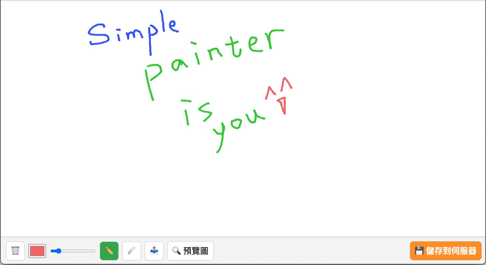

# 線上畫板



## 簡介
一個簡單的 Node.js + Express 線上畫板範例，前端使用 Canvas 繪圖，後端將繪畫圖進行保存。

---

## 功能

- 畫板 (Canvas)
- 繪圖同步保存成 PNG
- 簡易前後端整合，無須額外資料庫

---

## 專案結構

```
pdf-signature-app/
├── public/
│   ├── index.html
├── drawings/               # 上傳繪圖檔保存位置
├── server.js
├── package.json
└── README.md
```

---

## 快速開始

1. Clone 專案或下載 ZIP  
2. 安裝套件

```bash
npm install
```

3. 建立資料夾

```bash
mkdir drawings
```

4. 啟動伺服器

```bash
node server.js
```

5. 開啟瀏覽器並訪問

```
http://localhost:3000
```

---

## 使用說明

- 上傳你要簽署的 PDF 檔案  
- 在畫圖區塊選擇畫筆與顏色創作
- 點擊「存檔」  
- 伺服器 `drawings/` 會保存圖片 PNG  

---

## 授權

MIT License

---

## 聯絡

有問題或建議歡迎提 issue 或聯絡作者。
